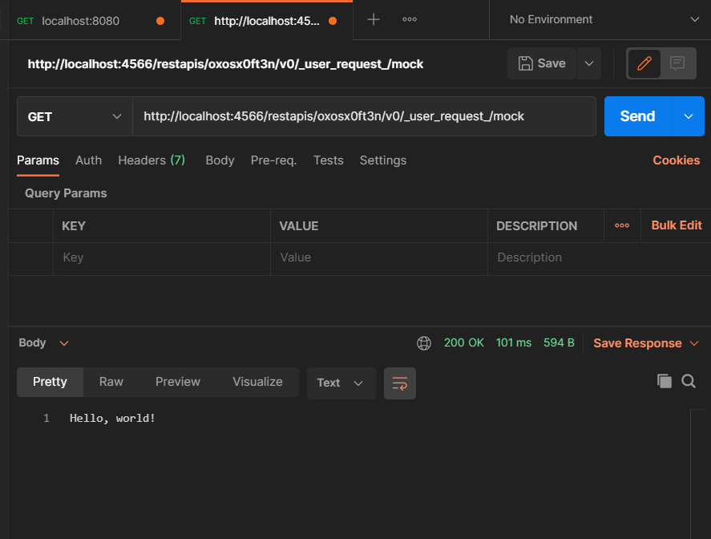

# ApiGateway Proxy to Spring Container using LocalStack

This assumes you have `awslocal` installed to simplify the calls to localstack.
```
pip install awscli-local
```
Otherwise, you can substitute the calls to this by passing in the localstack endpoint
```
aws ...  --endpoint-url=http://localstack:4566
```

You'll also need [docker-compose](https://docs.docker.com/compose/install/).

## Steps to build and run:
1. The container for the Spring Boot application needs to be built with Docker

(The tag name can be whatever you want, but must be updated in the [./docker-compose.yaml](./docker-compose.yaml) file.)
```sh
docker build . -t scgrk/shw
```

2. Start the docker services and wait for everything to be ready.
```sh
docker-compose up
```

You'll know when the Spring Application is running when you see:
```
spring-helloworld_1  | 2021-03-05 18:28:56.532  INFO 112 --- [           main] c.s.helloworld.HelloWorldApplication     : Started HelloWorldApplication in 0.808 seconds (JVM running for 0.992)
```

You'll know localstack is ready when you see:
```
localstack_demo      | Waiting for all LocalStack services to be ready
localstack_demo      | Ready.
localstack_demo      | 2021-03-05T18:47:22:INFO:localstack.utils.analytics.profiler: Execution of "start_api_services" took 5047.660112380981ms
```

If your Spring container has the dependencies cached already, it may be ready before localstack. Otherwise, if downloading the dependencies, it is likely localstack will be ready before Spring.

3. Create a new CloudFormation stack on LocalStack
```sh
awslocal cloudformation create-stack --stack-name 'test-stack' --template-body file://gateway.yaml
```

This will create a CF stack on localstack and give you information about the creation.

```
localstack_demo      | 2021-03-05T18:29:07:DEBUG:localstack.services.cloudformation.cloudformation_api: Creating stack "test-stack" with 6 resources ...

# .... snip

localstack_demo      | 2021-03-05T18:59:07:DEBUG:localstack.utils.cloudformation.template_deployer: Request for resource type "ApiGateway::Stage" in region us-east-1: create_stage {'deploymentId': '6x7783s40k', 'description': 'Mock API Stage v0', 'restApiId': 'oxosx0ft3n', 'stageName': 'v0'}
```

This has the information we need for querying the endpoint in Postman, particularly the `restApiId`.

4. Test the API with the following endpoint:
```
http://localhost:4566/restapis/<REST_API_ID>/v0/_user_request_/mock
```

With the example output above, we'll use

```
http://localhost:4566/restapis/oxosx0ft3n/v0/_user_request_/mock
```

This will then proxy to the Spring application and return the result.


